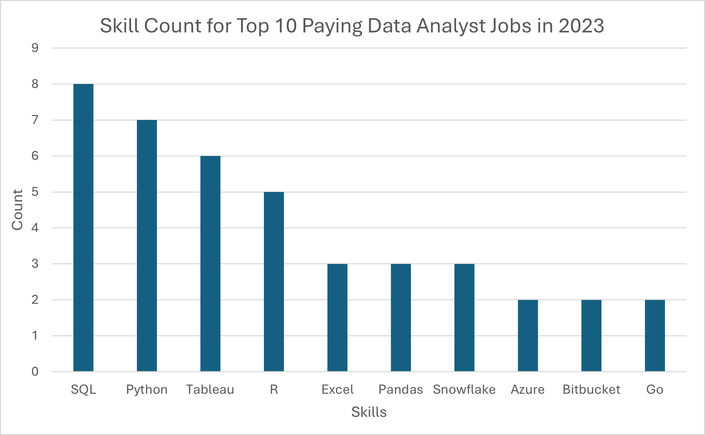

# Introduction
Data plays a critical role in all industries, enabling companies to identify opportunities for improving their market positioning. As a result, there has been a rise in the number of job openings for various data-related roles. In this report, I analyzed the 2023 data analyst job postings to identify the skills that can lead to higher-paying jobs for experienced professionals. Additionally, I also determined the key skills that individuals should acquire to enter and advance in this growing field.

SQL queries? Check the out here: [project_queries](/project_queries/)
# Background
The point of doing this analysis is to develop a firm understanding of what skills one should be focusing on to get started.  

### The questions I wanted to answer through my SQL queries were:

1. What are the top-paying data analyst jobs?
2. What skills are required for these top-paying jobs?
3. What skills are most in demand for data analysts?
4. Which skills are associated with higher salaries?
5. What are the most optimal skills to learn for a data analyst looking to maximize job market value?

# Tools I Used
- **SQL:** I used this to query the database and gain critical insights.

- **PostgreSQL:** I chose this database management system because it's robust, has a large userbase, and is ideal for handling job posting data.

- **Visual Studio Code:** I utilized this code editor because it supports many database management extensions and offers great functionality.

- **Git & GitHub:** I used this version control tool for sharing my SQL query scripts and analysis, as well as for collaboration and project tracking. The readme section has amazing functionality for creating reports.

# The Analysis
Each query aims to answer the question which were laid out earlier in the background section. Following are the queries are performed to get the most demanding skills and most optimal skills to learn to secure good paying job as a data analyst.

### 1. Top Paying Data Analayst Jobs
This query highlights the highest-paying remote Data Analyst positions that do not require a degree. It helps identify attractive job opportunities for candidates who might not have formal qualifications but still want to focus on well-compensated roles.
```sql
SELECT	
	job_postings_fact.job_id,
	job_title,
	job_location,
	job_schedule_type,
	salary_year_avg,
	job_posted_date,
    company_dim.name AS company_name,
    job_no_degree_mention
FROM
    job_postings_fact
LEFT JOIN company_dim ON job_postings_fact.company_id = company_dim.company_id
WHERE
    job_title_short = 'Data Analyst' AND
    job_location = 'Anywhere' AND 
    job_no_degree_mention = TRUE AND
    salary_year_avg IS NOT NULL
ORDER BY 
    salary_year_avg DESC
LIMIT 10;
```
Here's the breakdown of the top data analyst job in 2023:

- **Competitive Salaries Without Degree Requirements:** There are high-paying roles available that do not require a formal degree, making them accessible to candidates based on skills and experience rather than academic qualifications. This highlights the growing value of practical expertise over formal education in certain fields.

- **Variety of Job Titles and Seniority Levels:**
 The job market offers a range of positions, from entry-level to senior roles, for data-related positions. This indicates opportunities for candidates at different stages of their careers, whether they are just starting or looking to move into leadership.

- **Emphasis on Remote Work:**
The majority of these roles are remote, showing a significant shift toward flexible work environments. This trend opens up opportunities for a global workforce, allowing professionals to work from anywhere while accessing competitive job markets.

Below is the visual to lookout differents roles with highpay salaries.


### 2 Top Paying Skills
This query highlights the count of the skills listed for the job postings with the highest-paying remote Data Analyst positions. It helps identify skills to focus on for candidates who want to jump-start their career in the Data Analyst realm.

```sql
WITH top_paying_jobs AS (
    SELECT
        job_id,
        job_title,
        name AS company_name,
        salary_year_avg
    FROM
        job_postings_fact
    LEFT JOIN company_dim ON job_postings_fact.company_id = company_dim.company_id
    WHERE
        job_title_short = 'Data Analyst'
		AND salary_year_avg IS NOT NULL
        AND job_location = 'Anywhere'
    ORDER BY
        salary_year_avg DESC
    LIMIT 10
)
-- Skills required for data analyst jobs

SELECT
    top_paying_jobs.job_id,
    job_title,
    salary_year_avg,
    company_name,
    skills
FROM
    top_paying_jobs
	INNER JOIN
    skills_job_dim ON top_paying_jobs.job_id = skills_job_dim.job_id
	INNER JOIN
    skills_dim ON skills_job_dim.skill_id = skills_dim.skill_id
ORDER BY
    salary_year_avg DESC
LIMIT 10
```


Here's the column chart to illustrate the top skills for the highest paying data jobs. This would help more experienced individuals secure more rewarding jobs or get promotions.



*These insights show that SQL, Python, and 
Tableau are highly sought-after skills for data analyst roles,indicating their importance in data analysis tasks and visualization.*

### 3 In-Demand Skills for Data Analyst

This query is used to identify the skills most frequently mentioned in job postings, helping to prioritize the most important skills to learn first.

```sql
SELECT 
    skills,
    COUNT(skills_job_dim.job_id) AS demand_count
FROM job_postings_fact 
INNER JOIN skills_job_dim ON job_postings_fact.job_id = skills_job_dim.job_id
INNER JOIN skills_dim     ON skills_job_dim.skill_id  = skills_dim.skill_id
WHERE 
    job_title_short = 'Data Analyst'
GROUP BY 
    skills
ORDER BY 
    demand_count DESC
LIMIT 5;
```

Here's the breakdown of the most demanded skills for data analyst in 2023.

- **SQL** and **Excel** remain fundamental, emphasizing the need for strong foundational skills in data processing and spreadsheet manipulation.

- **Programming** and **Visualization** Tools like **Python**, **Tableau**, and **Power BI** are essential, pointing towards the increasing importance of technical skills in data storytelling and decision support.


| Skills   | Demand Count |
|----------|--------------|
| SQL      | 92628        |
| Excel    | 67031        |
| Python   | 57326        |
| Tableau  | 46554        |
| Power BI | 39468        |   


*Table of the demand for the top 5 skills in Data analyst job postings.* 

### 4 Skills Based on Salary
This section will help to idendify the average salaries associated with the different skills revealed which skills are the highest paying.
```sql
SELECT
  skills_dim.skills AS skill, 
  ROUND(AVG(job_postings_fact.salary_year_avg),2) AS avg_salary
FROM
  job_postings_fact
	INNER JOIN
	  skills_job_dim ON job_postings_fact.job_id = skills_job_dim.job_id
	INNER JOIN
	  skills_dim ON skills_job_dim.skill_id = skills_dim.skill_id
WHERE
  job_postings_fact.job_title_short = 'Data Analyst' 
  AND job_postings_fact.salary_year_avg IS NOT NULL 
  AND job_work_from_home = True  -- optional to filter for remote jobs
GROUP BY
  skills_dim.skills 
ORDER BY
  avg_salary DESC;
  ```
Here's a breakdown of the results for top paying skills for Data Analysts:

- **High specialization yields better pay:** Specialized skills (e.g., **PySpark, Couchbase, Watson**) command significantly higher salaries than more general-purpose tools.

- **AI and big data proficiency:** Machine learning and big data platforms are key drivers of salary growth. Professionals who can work with these technologies are the highest earners in the data analyst space.

- **Broad skillset is valued:** The mix of tools, from development platforms (**GitLab, Bitbucket**) to data science environments (**Jupyter, Pandas**), indicates that employers are looking for versatility in their data analysts—professionals who can code, collaborate, and handle diverse datasets effectively.


This data suggests that if you aim to pursue a career as a top-paid data analyst, focusing on big data technologies, machine learning tools, and automation platforms will position you in a highly lucrative market. These skills are not just desired but essential for companies seeking to leverage data for decision-making, innovation, and growth.


| Skill        | Avg Salary ($) |
|--------------|----------------|
| PySpark      | 208,172         |
| Bitbucket    | 189,155         |
| Watson       | 160,515         |
| Couchbase    | 160,515         |
| DataRobot    | 155,486         |
| GitLab       | 154,500         |
| Swift        | 153,750         |
| Jupyter      | 152,777         |
| Pandas       | 151,821         |
| Elasticsearch| 145,000         |

*Table of the average salary for the top 10 paying skills for the data analysts*


### 5 Most Optimal Skills to Learn

Combining insights from demand and salary data, this query aimed to pinpoint skills that are both in high demand and have high salaries, offering a strategic focus for skill development.


```sql
WITH skills_demand AS (
  SELECT
    skills_dim.skill_id,
	skills_dim.skills,
    COUNT(skills_job_dim.job_id) AS demand_count
  FROM
    job_postings_fact
    INNER JOIN
	    skills_job_dim ON job_postings_fact.job_id = skills_job_dim.job_id
	INNER JOIN
	    skills_dim ON skills_job_dim.skill_id = skills_dim.skill_id
  WHERE
    job_postings_fact.job_title_short = 'Data Analyst'
	AND job_postings_fact.salary_year_avg IS NOT NULL
    AND job_postings_fact.job_work_from_home = True
  
  GROUP BY
    skills_dim.skill_id
),

-- Skills with high average salaries for Data Analyst roles

average_salary AS (
    SELECT
        skills_job_dim.skill_id,
        AVG(job_postings_fact.salary_year_avg) AS avg_salary
    FROM
        job_postings_fact
	INNER JOIN
	    skills_job_dim ON job_postings_fact.job_id = skills_job_dim.job_id

	  -- There's no INNER JOIN to skills_dim because we got rid of the skills_dim.name 

  WHERE
        job_postings_fact.job_title_short = 'Data Analyst'
		AND job_postings_fact.salary_year_avg IS NOT NULL
        AND job_postings_fact.job_work_from_home = True

  GROUP BY
        skills_job_dim.skill_id
)
-- Return high demand and high salaries for 10 skills 

SELECT
    skills_demand.skills,
    skills_demand.demand_count,
    ROUND(average_salary.avg_salary, 2) AS avg_salary --ROUND to 2 decimals 

FROM
    skills_demand

INNER JOIN
	average_salary ON skills_demand.skill_id = average_salary.skill_id

WHERE demand_count > 10

ORDER BY
    demand_count DESC, 
    avg_salary DESC

LIMIT 10 ;
```
Here's the breakdown of the results.
Top Skills to Focus On:
- **SQL and Python:** Learning these two skills will cover both the highest demand and strong salaries.

- **Tableau and Power BI:** Visualization tools are essential for presenting data, and learning one or both will boost employability.

- **R or SAS:** These are more niche but important for statistical analysis, especially if you are aiming for data science roles.

Focusing on these key areas will help you become a well-rounded data analyst.

| Skill      | Demand Count | Average Salary ($) |
|------------|---------------|-------------------|
| SQL        | 398           | 97,237.16         |
| Excel      | 256           | 87,288.21         |
| Python     | 236           | 101,397.22        |
| Tableau    | 230           | 99,287.65         |
| R          | 148           | 100,498.77        |
| Power BI   | 110           | 97,431.30         |
| SAS        | 63            | 98,902.37         |
| PowerPoint | 58            | 88,701.09         |
| Looker     | 49            | 103,795.30        |

*Table of most optimal skills for data analyst sorted by demand*

# What I Learned
The process of learning SQL and delving into the dataset provided me with valuable insight into which skills to prioritize and how to advance in my career. I gained expertise in various SQL skills, such as data manipulation, updates, and retrieval, and learned to analyze diverse datasets using different join methods across multiple tables. Additionally, I became proficient in using the popular dataset management tool, PostgreSQL, as well as VSCode and Github, both of which are essential tools to master. VSCode's user-friendly interface and support for numerous skill extensions, along with the collaborative capabilities of Github, have empowered me to work efficiently and showcase my work to a wider audience.
# Conclusions
This project improved my SQL skills and provided valuable insights into the data analyst job market. The findings from the analysis serve as a guide for prioritizing skill development and job search efforts. Aspiring data analysts can better position themselves in a competitive job market by focusing on high-demand, high-salary skills. This exploration highlights the importance of continuous learning and adaptation to emerging trends in the field of data analytics.
